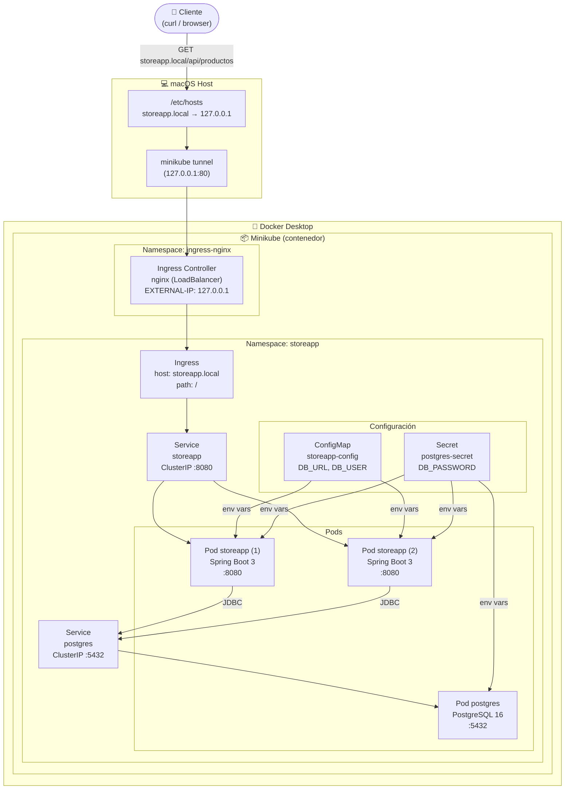
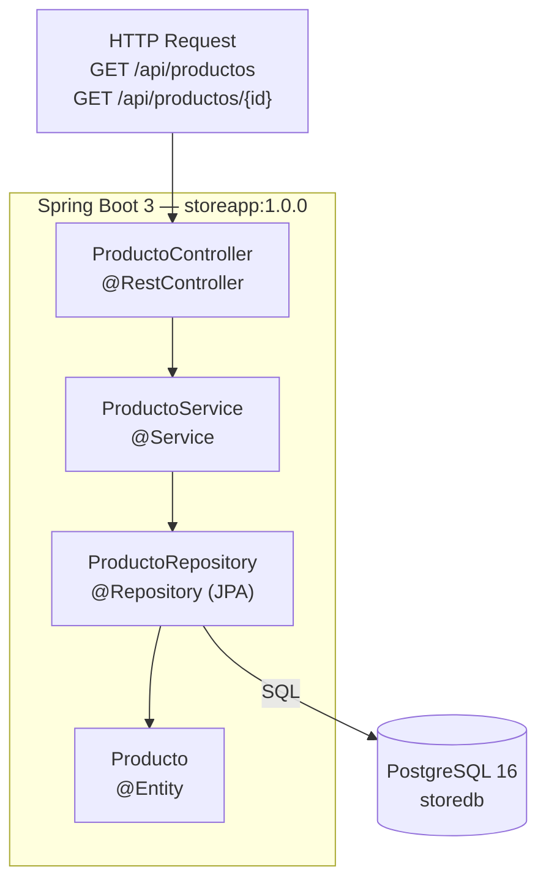
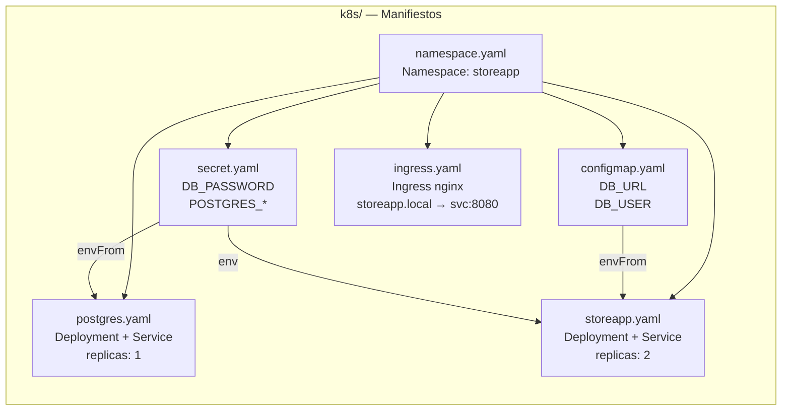
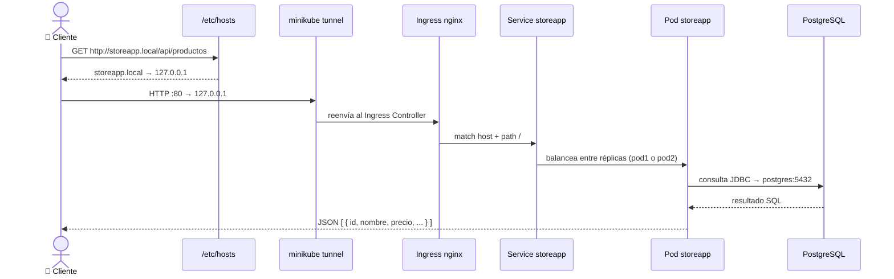

# Arquitectura — storeApp

---

## Diagrama general

---

## Diagrama de capas de la aplicación (Spring Boot)

---

## Diagrama de manifiestos Kubernetes

---

## Flujo de red en macOS (Docker driver)

---

## Resumen de componentes

| Componente | Tipo | Namespace | Puerto | Réplicas |
|------------|------|-----------|--------|----------|
| `storeapp` | Deployment + Service | `storeapp` | 8080 | 2 |
| `postgres` | Deployment + Service | `storeapp` | 5432 | 1 |
| `storeapp` (ingress) | Ingress | `storeapp` | 80 | — |
| `ingress-nginx-controller` | Service LoadBalancer | `ingress-nginx` | 80/443 | — |
| `storeapp-config` | ConfigMap | `storeapp` | — | — |
| `postgres-secret` | Secret | `storeapp` | — | — |

